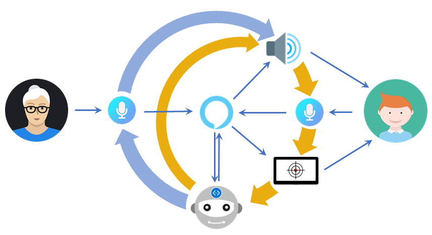
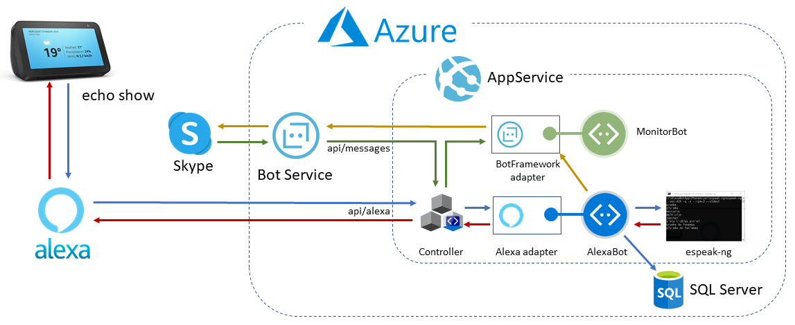
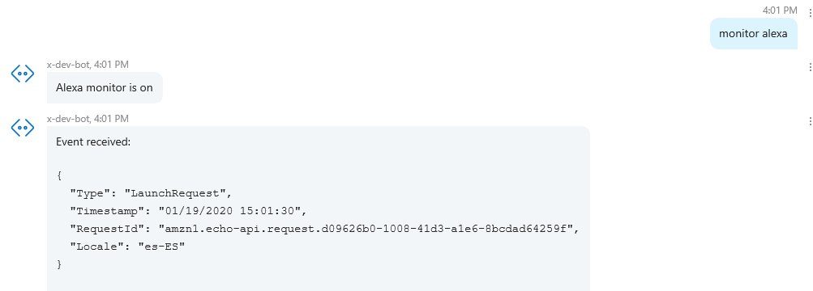
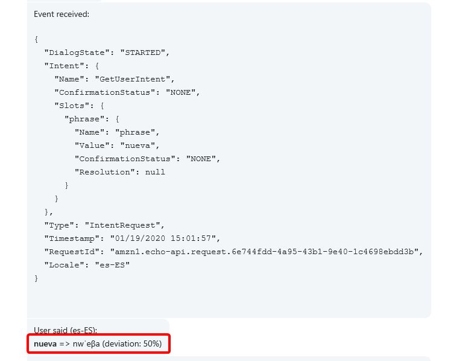

# human-learning

This repo contains the source for the "Human Learning con Alexa" presentation given by [@ESalcedoo](https://twitter.com/ESalcedoo) and myself ([@mvelosop](https://twitter.com/mvelosop)) for the [NetCoreConf Barcelona 2020](https://web.archive.org/web/20200119112154/https://netcoreconf.com/barcelona.html) conference.

## Overview

This is a Proof of Concept (POC) project for a language therapist virtual assistant based on Alexa.

The assistant is currently working in **Spanish**, but it should be easy to adapt to any other language.

### Main interaction scenario

1. The Alexa skill is activated with "**Abre Human Learning**" and the assistant greets back.
2. The assistant asks for the exercise phrase.
3. The therapist should then set the target word or phrase with "**trabajar '*target word*'**".
4. The assistant then asks the patient to repeat the word and waits to hear it back.
5. The patient pronounces the '***target word***'.
6. The assistant speaks back the text returned by the Alexa Voice Service and calculates a phonetic deviation.
7. The assistant displays some visual feedback about the phonetic deviation.
8. GOTO (deviation == 0 ? #2 : #4).

- To finish say "**Adiós**" (goodbye) at any time. This ends the current exercise as not successful.
- To pause say "**Pausa**" (pause) at any time. When resuming with "**Abre Human Learning**" the assistant will continue with the previous target word.
- If Alexa times out waiting to hear the phrase, the assistant ends as if **pause** was requested.

The following diagram illustrates the interaction:

### Architecture

This is the general architecture diagram for the solution:

#### Details

- All exercises are stored in an SQL database
- All patient utterances are also stored in the database including the phonemes using the [IPA Unicode phoneme symbols](https://en.wikipedia.org/wiki/Phonetic_symbols_in_Unicode).
- The phoneme symbols are obtained with the [espeak-ng](https://github.com/espeak-ng/espeak-ng) program.
  - espeak-ng is running continuously as a console app, and is started as a background process.
  - The phonemes conversion is done handling the **sdtin** and **stdout** streams from **espeak-ng**. 
  - This means the phonemes handled are not the actually pronounced phonemes, that are not returned from the Alexa Voice Service (AVS).
- The phonetic deviation is calculated from the [Levenshtein distance](https://en.wikipedia.org/wiki/Levenshtein_distance) when comparing normalized target phonemes with utterance phonemes. (Normalization removes spaces and emphasis)
- Bot state is using a memory backing, so it's not preserved between AppService restarts.
- There's a linked **MonitorBot** that can be used to monitor the interactions with the AlexaBot through any Bot Service channel.
- To activate the MonitorBot, type "monitor alexa" from the channel as shown next.
- The visual feedback is currently using animated gifs (from `wwwroot/media`) but the **echo show** device doesn't support them. In the meantime use the Alexa developer portal.

#### Using the MonitorBot

Enabling the monitor:

Receiving utterances:

#### Using the Alexa Developer Portal

## Deployment

For detailed deployment steps see the deployment section from the blog post: [How to receive events in a Bot Framework SDK v4 Web API bot?](https://www.coderepo.blog/posts/how-to-receive-events-bot-framework-sdk-v4-web-api-bot/#deployment)

Use interaction model in `deploy\Alexa-models\interaction-model.es.json` to configure the Alexa skill. Remember to configure the skill endpoint to point to your deployed AppService plus `api/alexa`.

## Resources

- Bot Framework SDK \
  <https://github.com/Microsoft/botframework-sdk>

- Bot Builder Community - .NET Extensions \
  <https://github.com/BotBuilderCommunity/botbuilder-community-dotnet>

- Get Started with the Alexa Skills Kit \
  <https://developer.amazon.com/en-US/alexa/alexa-skills-kit/start>

- Bot Builder Community .NET package source \
  <https://www.myget.org/F/botbuilder-community-dotnet/api/v3/index.json>

- espeak-ng \
  <https://github.com/espeak-ng/espeak-ng>

